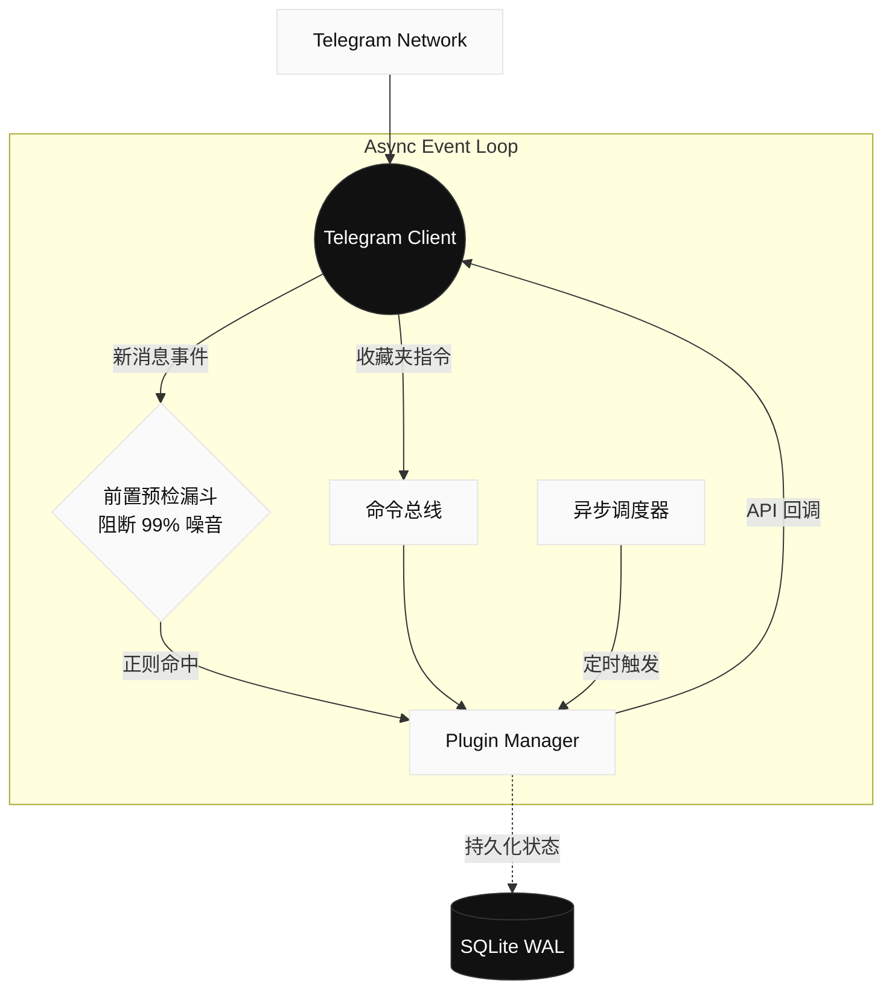

<div align="center">


# TG-Radar

**下一代 Telegram 事件路由与高并发监控引擎** <br />
专为高并发、低延迟环境设计，基于单线程异步核心构建。

<br />

[**🚀 快速部署**](#-快速部署) · [**🏗 架构概览**](#-系统架构) · [**🧩 插件生态**](https://github.com/x72dev/TG-Radar-Plugins)

</div>

---

## ⚡ 核心定位

TG-Radar 并非传统的单体 Userbot 脚本。它是一个现代化的企业级监控基座，采用 **前置预检漏斗 (Pre-check Funnel)** 架构。在事件触达应用层之前，于网络边缘直接丢弃 99% 的噪音数据，彻底消除无效的 API 开销。

## ✨ 技术特性

- **极致过滤性能** — 全量事件流在接入层即刻接受轻量级矩阵评估，未命中规则的消息被瞬间丢弃。
- **单核异步并发** — 驱动于 `asyncio` 与单路 `TelegramClient`，在单一的无阻塞事件循环中极速处理高频消息与指令路由。
- **零停机热重载** — 无缝更新正则规则、替换业务逻辑或部署全新插件，全程无需重启容器或中断监听。
- **状态安全持久化** — 底层采用 SQLite WAL 模式，确保在异步高并发环境下的读写强一致性与海量日志的安全落盘。

## 🚀 快速部署

我们推崇不可变的基础设施。使用官方自动化脚本，即可一键完成 Docker 环境配置、依赖拉取与 Telegram 鉴权。

> [!WARNING]
> **风控与合规提示**
> 使用 Telethon 部署 Userbot 存在客观的封控风险。**强烈建议使用高权重老号**。请严格控制入群频率，避免触发 Telegram 的 `FloodWait` 熔断机制。

```bash
bash <(curl -sL https://raw.githubusercontent.com/x72dev/TG-Radar/main/docker-install.sh)
```

<details>
<summary><b>手动 Docker 构建与 Systemd 源码部署</b></summary>

<br/>

**手动构建容器 (Docker)**
```bash
git clone https://github.com/x72dev/TG-Radar.git && cd TG-Radar
git clone https://github.com/x72dev/TG-Radar-Plugins.git plugins-external/TG-Radar-Plugins

cp config.example.json config.json
# 填入 API_ID 与 API_HASH

docker compose build
docker compose run --rm tg-radar auth  # 交互式授权验证
docker compose run --rm tg-radar sync  # 首次基础数据同步
docker compose up -d                   # 守护进程启动
```

**裸机部署 (Systemd)**
```bash
bash <(curl -sL https://raw.githubusercontent.com/x72dev/TG-Radar/main/install.sh)
```

</details>

## 🏗 系统架构

TG-Radar 采用高内聚的异步单核设计。以下是基于 `asyncio` 事件循环的数据流转模型：



## 🔌 控制台指令

业务逻辑的流转由插件全面接管。直接在 Telegram 的 **收藏夹 (Saved Messages)** 中发送指令，即可完成对整个系统的调度。

| 命令 | 描述 |
| :--- | :--- |
| `-status` | 打印系统健康度报告与内存使用快照 |
| `-folders` / `-rules` | 检视或更新当前的监控集群分组与正则匹配栈 |
| `-addrule` / `-delrule` | 动态注入或卸载业务关键词 |
| `-reload [plugin]` | **无感重载指定插件的内存上下文** |
| `-update` | 触发远端仓库拉取并执行平滑重启机制 |

> **深入插件生态**：系统内置基础管控模块，如需更复杂的路由与业务分析，请参阅 [TG-Radar 插件集市](https://github.com/x72dev/TG-Radar-Plugins)。

## ⚖️ 免责声明

TG-Radar 仅作为底层技术研究与企业内部自动化运维的测试工具。我们不对因不当使用导致的账号封禁、数据损毁或任何衍生法律后果承担责任。使用者应当自觉遵守 Telegram 服务条款（TOS）及部署所在地的法律法规。严禁将本系统应用于任何违规数据爬取、骚扰或灰黑产业务。