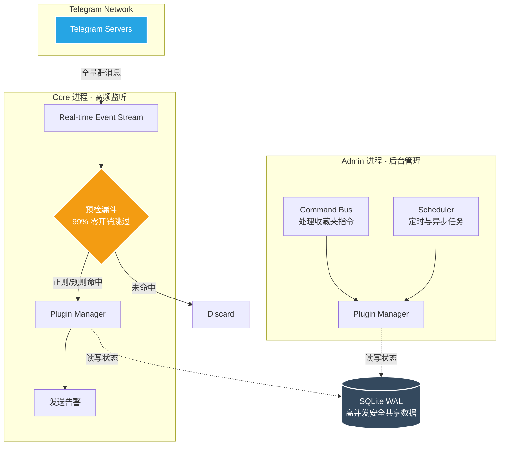

<div align="center">

<!-- 炫酷动态 Header -->


<a href="https://git.io/typing-svg"></a>

<br/>

[](https://github.com/x72dev/TG-Radar)&nbsp;
[](https://python.org)&nbsp;
[](https://www.docker.com)&nbsp;
[](https://github.com/LonamiWebs/Telethon)&nbsp;
[](LICENSE)

<br/>

[**🚀 快速开始**](#-快速部署) · [**📚 核心特性**](#-为什么选择-tg-radar) · [**🧩 插件集市**](https://github.com/x72dev/TG-Radar-Plugins) · [**⌨️ 命令手册**](#%EF%B8%8F-命令手册)

</div>

---

## 💡 为什么选择 TG-Radar？

与传统的 Userbot 脚本不同，TG-Radar 是专为**高并发**、**低延迟**和**极客体验**打造的企业级监控引擎：

- 🚀 **极致性能预检**：采用前置预检漏斗（Pre-check Filter），**99% 的噪音消息在触发 API 调用前被零开销过滤**。真正做到单机轻松抗住千个超级群组的实时并发。
- 🧩 **高维架构解耦**：一切皆插件。业务逻辑与核心引擎完全物理隔离，支持毫秒级热重载（Hot-Reload）。核心进程（Core）与管理进程（Admin）双轨运行，互不干扰。
- 🐳 **容器化原生设计**：抛弃繁琐的 Python 环境配置，提供完备的 Docker 镜像。所有数据（Session、配置、日志）通过 SQLite WAL 机制安全持久化，真正做到**开箱即用，即焚即走**。
- 🛡️ **自愈与熔断机制**：内置 Session 自动恢复与错误熔断器。当某个插件连续报错时会自动隔离停用，绝不影响系统全局稳定性。

---

## 📸 运行效果 (Preview)

> 💡 **提示**：目前这里使用了一张极客风的骇客帝国动图作为占位演示。您后续可以在本地准备一张真实的终端操作录屏 (如使用 `vhs` 或 `asciinema` 录制，并存放到 `docs/assets/demo.gif`) 进行替换。

<div align="center">
  
</div>

---

## ⚡ 快速部署

> [!WARNING]
> **账号风控提示**：基于 Telethon 的 Userbot 模式具有一定被封号风险。
> - **强烈建议使用注册时间较长的老号**作为监控号，不要使用刚注册的新号。
> - 不要频繁进行大规模的同步或加入大量群组操作，以防触发 Telegram 的 `FloodWait` 限制。

### 🐳 Docker 一键部署（极度推荐）

无需克隆代码，准备好全新的 Linux 服务器，使用 root 权限执行以下一键脚本即可完成：`安装 Docker` → `拉取仓库` → `配置凭据` → `授权登录` → `启动服务` 的全流程。

```bash
bash <(curl -sL https://raw.githubusercontent.com/x72dev/TG-Radar/main/docker-install.sh)
```

<details>
<summary><b>🛠️ 需要手动 Docker 部署或传统 Systemd 源码安装？点击展开</b></summary>

**手动 Docker 安装：**
```bash
git clone https://github.com/x72dev/TG-Radar.git && cd TG-Radar
git clone https://github.com/x72dev/TG-Radar-Plugins.git plugins-external/TG-Radar-Plugins

cp config.example.json config.json
nano config.json  # 填入您的 api_id 和 api_hash

docker compose build
docker compose run --rm tg-radar auth  # 交互式授权
docker compose run --rm tg-radar sync  # 首次同步数据
docker compose up -d                   # 后台启动
```

**传统部署（基于 Systemd）：**
```bash
bash <(curl -sL https://raw.githubusercontent.com/x72dev/TG-Radar/main/install.sh)
```
</details>

---

## 🏗️ 系统架构

TG-Radar 采用双进程隔离架构，确保指令处理与高频消息监听互不阻塞。GitHub 原生支持以下 Mermaid 架构图的高清自适应渲染：



---

## 🔌 插件生态与热重载

TG-Radar 所有的核心业务逻辑（包括关键词监控、管理面板、自动路由等）均作为独立插件运行在 [**TG-Radar-Plugins**](https://github.com/x72dev/TG-Radar-Plugins) 仓库中。

- **🔥 热重载 (Hot-Reload)**：修改插件代码或配置后，只需在收藏夹发送 `-reload 插件名`，即可在**不重启主进程**的情况下秒级生效。
- **📦 极简 SDK**：提供 `from tgr.plugin_sdk import PluginContext` 极简接口，几行代码即可完成一个强大插件的开发。

---

## ⌨️ 命令手册

> 💡 **所有命令默认在 Telegram 的「收藏夹 (Saved Messages)」中发送，默认前缀为 `-`。**

<details>
<summary><b>1. 🖥️ 系统与通用管理</b></summary>

| 命令 | 说明 |
|:--|:--|
| `-help` | 查看所有可用命令列表 |
| `-ping` | 心跳检测，查看机器人存活状态 |
| `-status` / `-version` | 查看系统运行状态与当前版本 |
| `-config` | 查看当前核心配置参数 |
| `-log [scope] [n]` | 查看系统或插件的实时事件日志 |
| `-jobs` | 查看后台正在运行的异步队列任务 |
| `-restart` / `-update` | 重启服务 / 自动拉取 Git 最新代码并热重载 |
</details>

<details>
<summary><b>2. 📁 分组与规则配置</b></summary>

| 命令 | 说明 |
|:--|:--|
| `-folders` | 查看所有监控分组及状态 |
| `-rules [分组名]` | 查看指定分组下的详细监控规则 |
| `-enable / -disable [分组名]` | 快捷开启或关闭某个分组的监控 |
| `-addrule 分组名 规则名 关键词...`| 向分组追加关键词（**原生支持正则表达式**） |
| `-setrule 分组名 规则名 表达式` | 覆盖现有规则内容 |
| `-delrule 分组名 规则名 [词...]` | 删除规则或规则中的指定词 |
| `-setnotify / -setalert ID` | 设定系统通知频道 / 监控告警接收频道 |
</details>

<details>
<summary><b>3. 🧩 插件状态管理</b></summary>

| 命令 | 说明 |
|:--|:--|
| `-plugins` | 查看所有已安装插件的运行状态 |
| `-reload [插件名]` | 核心功能：对指定插件进行代码和配置的热重载 |
| `-pluginreload` | 全量重新加载所有插件 |
| `-pluginenable / -plugindisable` | 临时启用或停用某个插件 |
| `-pluginconfig 插件名 [键] [值]` | 动态查看或修改插件的 `configs/*.json` 配置 |
</details>

---

## ❓ 常见问题 (FAQ)

<details>
<summary><b>Q1: 遇到 <code>Session expired / revoked</code> 怎么办？</b></summary>
这通常是因为您在其他设备上主动终止了该会话，或者 Telegram 官方重置了您的登录状态。您需要重新进行授权：<br>
执行 <code>docker compose run --rm tg-radar auth</code>，按照提示重新输入手机号和验证码即可覆盖旧会话。
</details>

<details>
<summary><b>Q2: 为什么我设置了关键词，但没有收到告警？</b></summary>
排查步骤：<br>
1. 确认监控群组是否已在分组中，并且该分组的状态为 <b>启用</b>（<code>-folders</code> 查看）。<br>
2. 确认告警频道已正确设置（<code>-config</code> 查看 <code>global_alert_channel_id</code>）。<br>
3. 检查正则表达式是否正确匹配。可以使用简单的词语测试。<br>
4. 查看日志（<code>-log core</code>）确认是否有拦截记录或报错。
</details>

<details>
<summary><b>Q3: 如何获取某个群组的 ID？</b></summary>
只需**转发一条该群组内普通用户的消息**到您的收藏夹，TG-Radar 会自动识别并回复该群组的详细信息（包括群 ID）及快捷操作菜单。
</details>

---

## 👨‍💻 参与贡献

欢迎提交 Pull Request 或 Issue！您可以帮助我们开发新插件、修复 Bug 或完善文档。

<a href="https://github.com/x72dev/TG-Radar/graphs/contributors">
  
</a>

---

## 📄 免责声明 (Disclaimer)

本项目采用 [MIT License](LICENSE) 开源。

**本项目仅供学习、技术研究与系统运维测试用途**。使用者须确保行为符合所在地法律法规及 Telegram 服务条款。开发者不对因使用本工具导致的任何直接或间接损失（包括但不限于账号封禁、数据丢失）承担责任。严禁用于未经授权的监控、骚扰、诈骗等非法活动。所有数据仅存储在用户自己的服务器上，不传输至任何第三方。使用即表示您完全同意上述条款。

<div align="center">

</div>
