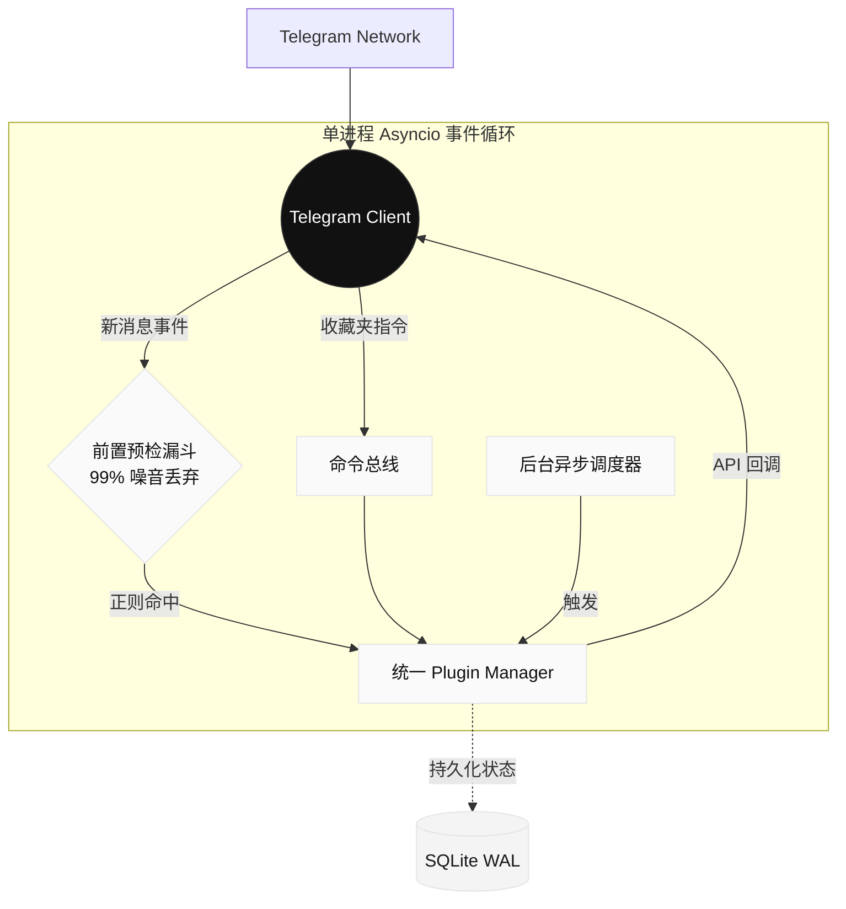

# TG-Radar

> **企业级 Telegram 事件监听与高并发预警路由引擎**
> 
> 基于完全解耦的单核异步架构，在接入层即刻阻断噪音数据。专为高并发、低延迟环境设计的现代化监控基座。

[快速部署](#🚀-快速部署) • [系统架构](#🏗-系统架构) • [插件生态](https://github.com/x72dev/TG-Radar-Plugins) • [控制台指令](#🔌-控制台指令)

---

## 📌 核心定位

TG-Radar 并非传统的单体 Userbot 脚本，而是一个专为**高并发、低延迟**环境设计的现代化监控基座。它采用前置预检漏斗（Pre-check Funnel）架构，在底层直接阻断 99% 的噪音数据，彻底消除无效的 API 开销。

系统通过完全解耦的**单核异步引擎**与**插件化架构**，将繁重的业务逻辑与底层通信剥离，实现了真正的毫秒级热重载（Hot-Reload）与零停机更新。

## ✨ 技术特性

- **极致过滤性能**：全量事件流在接入层即刻接受轻量级矩阵评估，未命中规则的消息被瞬间丢弃。
- **单核异步并发**：基于 `asyncio` 与单路 `TelegramClient` 驱动，所有的命令响应与海量消息监听均在一个无阻塞的事件循环中极速流转。资源占用极低。
- **零停机热重载**：无论是更新正则规则、替换业务逻辑，还是部署全新插件，均无需重启容器。
- **状态安全与持久化**：底层采用 SQLite WAL 模式，保障异步环境下的数据读写强一致性，并能完美承载海量日志。

## 🚀 快速部署

我们极力推崇不可变基础设施。推荐使用官方提供的自动化脚本，一键完成 Docker 环境配置、依赖拉取与 Telegram 鉴权。

```bash
bash <(curl -sL https://raw.githubusercontent.com/x72dev/TG-Radar/main/docker-install.sh)
```

> **⚠️ 风控与合规提示**  
> 使用 Telethon 进行 Userbot 部署存在客观的封控风险。**强烈建议使用高权重老号**。请严格控制入群频率，避免触发 Telegram 的 `FloodWait` 熔断机制。

<details>
<summary><b>查看手动 Docker 构建与 Systemd 源码部署方案</b></summary>

**手动构建容器：**
```bash
git clone https://github.com/x72dev/TG-Radar.git && cd TG-Radar
git clone https://github.com/x72dev/TG-Radar-Plugins.git plugins-external/TG-Radar-Plugins

cp config.example.json config.json
nano config.json  # 填入 API_ID 与 API_HASH

docker compose build
docker compose run --rm tg-radar auth  # 交互式授权验证
docker compose run --rm tg-radar sync  # 首次基础数据同步
docker compose up -d                   # 守护进程启动
```

**传统 Systemd 裸机部署：**
```bash
bash <(curl -sL https://raw.githubusercontent.com/x72dev/TG-Radar/main/install.sh)
```
</details>

## 🏗 系统架构

TG-Radar 采用高内聚的异步单核设计。以下模型图展示了基于 `asyncio` 事件循环的数据流转机制：



## 🔌 控制台指令

业务逻辑的流转由插件全面接管。您只需在 Telegram 的 **收藏夹 (Saved Messages)** 中发送指令，即可完成对整个系统的调度。

| 核心指令 | 释义与用途 |
| :--- | :--- |
| `-status` | 打印系统健康度报告与内存使用快照 |
| `-folders` / `-rules` | 检视或更新当前的监控集群分组与正则匹配栈 |
| `-addrule` / `-delrule` | 动态注入或卸载业务关键词 |
| `-reload [plugin]` | **无感重载指定插件的内存上下文** |
| `-update` | 触发远端仓库拉取并执行平滑重启机制 |

> **深入插件生态**：系统内置基础管控模块，更复杂的路由与业务分析，请参阅 [TG-Radar 官方插件集市](https://github.com/x72dev/TG-Radar-Plugins)。

## ⚖️ 声明

**核心免责条款**：  
TG-Radar 仅作为底层技术研究与企业内部自动化运维的测试工具。我们不对因不当使用导致的账号封禁、数据损毁或任何衍生法律后果承担责任。使用者应当自觉遵守 Telegram 服务条款（TOS）及部署所在地的法律法规。严禁将本系统应用于任何违规数据爬取、骚扰或灰黑产业务。