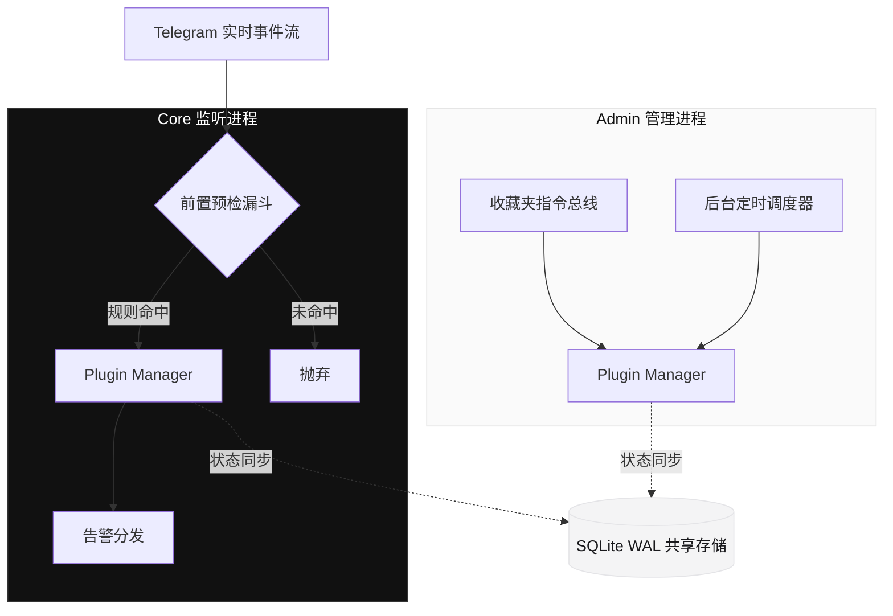

<div align="center">

# TG-Radar

**企业级 Telegram 事件监听与高并发预警路由引擎**

[](https://github.com/x72dev/TG-Radar/releases)
[](https://python.org)
[](https://www.docker.com)
[](LICENSE)

[**快速部署**](#-快速部署) • [**架构概览**](#-系统架构) • [**插件生态**](https://github.com/x72dev/TG-Radar-Plugins) • [**命令参考**](#-控制台指令)

---

</div>

## 📌 核心定位

TG-Radar 并非传统的单体 Userbot 脚本，而是一个专为**高并发、低延迟**环境设计的现代化监控基座。它采用前置预检漏斗（Pre-check Funnel）架构，在底层直接阻断 99% 的噪音数据，彻底消除无效的 API 开销。

系统通过完全解耦的**双核进程**与**插件化架构**，将繁重的业务逻辑与底层通信剥离，实现了真正的毫秒级热重载（Hot-Reload）与零停机更新。

## ✨ 技术特性

- **极致过滤性能**：全量事件流在接入层即刻接受轻量级矩阵评估，未命中规则的消息被瞬间丢弃。
- **双轨异步架构**：Core 进程专注于高频消息处理，Admin 进程负责调度与后台指令，确保终端指令响应不会阻塞实时监听。
- **零停机热重载**：无论是更新正则规则、替换业务逻辑，还是部署全新插件，均无需重启容器。
- **并发状态安全**：底层采用 SQLite WAL 模式，确保跨进程、高并发场景下的数据强一致性与绝对隔离。

## 🚀 快速部署

我们极力推崇不可变基础设施。推荐使用官方提供的自动化脚本，一键完成 Docker 环境配置、依赖拉取与 Telegram 鉴权。

```bash
bash <(curl -sL https://raw.githubusercontent.com/x72dev/TG-Radar/main/docker-install.sh)
```

> **⚠️ 风控与合规提示**  
> 使用 Telethon 进行 Userbot 部署存在客观的封控风险。**强烈建议使用高权重老号**。请严格控制入群频率，避免触发 Telegram 的 `FloodWait` 熔断机制。

<details>
<summary><b>查看手动 Docker 构建与 Systemd 源码部署方案</b></summary>

**手动构建容器：**
```bash
git clone https://github.com/x72dev/TG-Radar.git && cd TG-Radar
git clone https://github.com/x72dev/TG-Radar-Plugins.git plugins-external/TG-Radar-Plugins

cp config.example.json config.json
nano config.json  # 填入 API_ID 与 API_HASH

docker compose build
docker compose run --rm tg-radar auth  # 交互式授权验证
docker compose run --rm tg-radar sync  # 首次基础数据同步
docker compose up -d                   # 守护进程启动
```

**传统 Systemd 裸机部署：**
```bash
bash <(curl -sL https://raw.githubusercontent.com/x72dev/TG-Radar/main/install.sh)
```
</details>

## 🏗 系统架构

TG-Radar 采用严格的职责分离设计。以下模型图展示了系统内部的数据流转与状态同步机制：



## 🔌 控制台指令

业务逻辑的流转由插件全面接管。您只需在 Telegram 的 **收藏夹 (Saved Messages)** 中发送指令，即可完成对整个集群的调度。

| 核心指令 | 释义与用途 |
| :--- | :--- |
| `-status` | 打印系统健康度报告与内存使用快照 |
| `-folders` / `-rules` | 检视或更新当前的监控集群分组与正则匹配栈 |
| `-addrule` / `-delrule` | 动态注入或卸载业务关键词 |
| `-reload [plugin]` | **无感重载指定插件的内存上下文** |
| `-update` | 触发远端仓库拉取并执行平滑重启机制 |

> **深入插件生态**：系统内置基础管控模块，更复杂的路由与业务分析，请参阅 [TG-Radar 官方插件集市](https://github.com/x72dev/TG-Radar-Plugins)。

## ⚖️ 声明与协议

本项目基于 [MIT License](LICENSE) 许可协议开源。

**核心免责条款**：  
TG-Radar 仅作为底层技术研究与企业内部自动化运维的测试工具。我们不对因不当使用导致的账号封禁、数据损毁或任何衍生法律后果承担责任。使用者应当自觉遵守 Telegram 服务条款（TOS）及部署所在地的法律法规。严禁将本系统应用于任何违规数据爬取、骚扰或灰黑产业务。