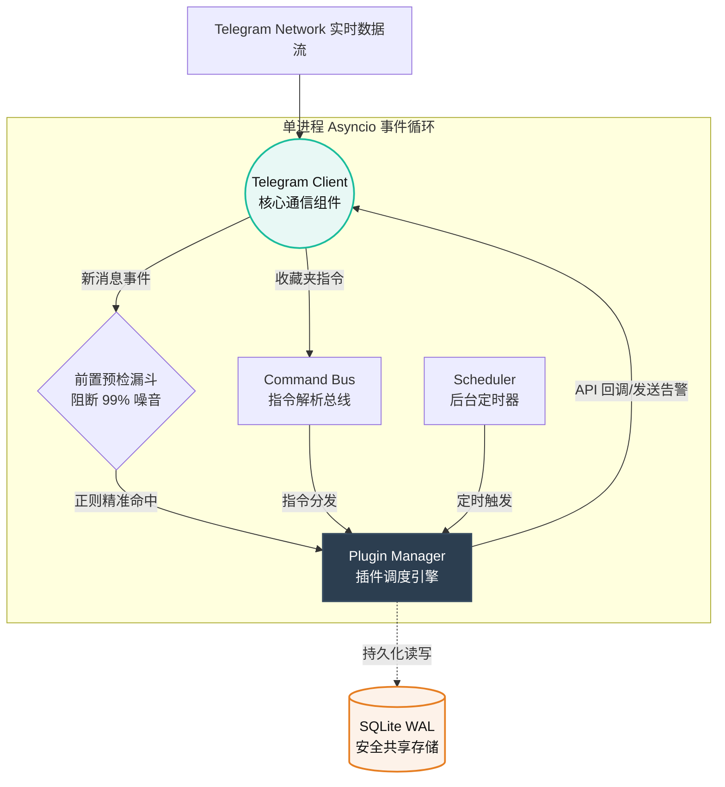

<div align="center">


**下一代 Telegram 智能风控与高并发预警路由引擎**

[](https://github.com/x72dev/TG-Radar)
[](https://python.org)
[](https://www.docker.com)
[](https://github.com/LonamiWebs/Telethon)
[](LICENSE)

[**核心特性**](#-核心特性) • [**系统架构**](#-系统架构) • [**部署指南**](#-部署指南) • [**命令手册**](#%EF%B8%8F-命令手册) • [**插件生态**](https://github.com/x72dev/TG-Radar-Plugins)

</div>

---

## 📖 项目简介

**TG-Radar** 绝非市面上常见的简易 Userbot 脚本。它是一个专为 **海量群组监控、高并发消息过滤、低延迟预警** 场景打造的企业级基座。

系统底层基于 `asyncio` 与 `Telethon` 构建了 **单核异步非阻塞** 引擎，独创的 **前置预检漏斗（Pre-check Funnel）** 能够在网络 I/O 层极速剥离 99% 的无用噪音数据，彻底避免无效的正则匹配与 API 开销。同时，其 **高度解耦的插件化架构** 赋予了系统极强的扩展能力与 **秒级热重载（Hot-Reload）** 特性。

---

## ✨ 核心特性

### 🚀 极致的性能压榨
- **前置预检漏斗**：拦截全量事件流，在调用任何繁重业务逻辑前，瞬间抛弃未命中的噪音消息。
- **单核异步并发**：整个应用（指令处理、后台调度、高频监听）统一部署于单路 `TelegramClient` 的事件循环中，内存与 CPU 占用极低，单机轻松抗住千群并发。

### 🧩 灵活的插件化生态
- **业务物理隔离**：所有的关键词监控、群组管理、流量路由均作为独立插件运行，核心引擎零业务代码。
- **无感热重载**：修改规则、更新代码或增删插件，只需一条 `-reload` 指令，无需重启容器，业务零中断。
- **熔断与自愈**：插件级错误沙盒。单一插件崩溃会被自动隔离并停用，绝不导致主引擎宕机。

### 🛡️ 工业级的数据安全
- **SQLite WAL 并发引擎**：摒弃脆弱的 JSON 存储，采用 SQLite 的 Write-Ahead Logging 模式，完美保障高并发异步环境下的读写强一致性。
- **Session 自愈机制**：内置会话状态监测，遇到断线或异常封控自动执行安全重置策略。

---

## 🏗 系统架构

系统采用高内聚的异步单进程设计，以下为数据流转模型：



---

## 🚀 部署指南

### 推荐：Docker 一键全自动部署

我们为您准备了极简的一键安装脚本，自动完成 `安装 Docker` → `拉取仓库` → `配置凭据` → `交互式授权` → `拉起守护进程` 的全套流程。

> [!WARNING]
> **账号风控提示**：基于 Userbot 模式具有一定封号风险。强烈建议使用**注册时间较长的高权重老号**，并控制加群频率以防触发 `FloodWait`。

```bash
bash <(curl -sL https://raw.githubusercontent.com/x72dev/TG-Radar/main/docker-install.sh)
```

<details>
<summary><b>🛠️ 展开查看：手动 Docker 构建步骤</b></summary>

<br/>

1. **克隆源码与插件库**：
```bash
git clone https://github.com/x72dev/TG-Radar.git && cd TG-Radar
git clone https://github.com/x72dev/TG-Radar-Plugins.git plugins-external/TG-Radar-Plugins
```

2. **配置 Telegram API**（请前往 [my.telegram.org](https://my.telegram.org) 获取）：
```bash
cp config.example.json config.json
nano config.json  # 填入 api_id 和 api_hash
```

3. **构建并授权**：
```bash
docker compose build
docker compose run --rm tg-radar auth  # 根据提示输入手机号与验证码
docker compose run --rm tg-radar sync  # 首次基础数据同步
```

4. **后台启动**：
```bash
docker compose up -d
```
</details>

---

## ⌨️ 命令手册

TG-Radar 的一切操控皆在 Telegram 的 **「收藏夹 (Saved Messages)」** 中完成。无需额外登录 Web 面板，随时随地掌控全局。（默认指令前缀为 `-`）

### 📊 1. 系统与状态监控
| 指令 | 描述 | 功能亮点 |
| :--- | :--- | :--- |
| `-status` | 系统状态大盘 | 展示运行时间、规则拦截率、内存与 CPU 负载快照 |
| `-ping` | 心跳延时测试 | 毫秒级探测当前与 Telegram DC 的网络延迟 |
| `-log [n]` | 实时日志追溯 | 在 TG 内直接翻阅系统底层日志与插件报错堆栈 |
| `-jobs` | 异步队列监控 | 查看当前后台正在挂载执行的定时与延时任务 |

### 📁 2. 路由分组与正则规则
| 指令 | 格式示例 | 描述 |
| :--- | :--- | :--- |
| `-folders` | `-folders` | 打印全局所有的监控群组列表及其启停状态 |
| `-rules` | `-rules [分组名]` | 检视指定分组下绑定的全部捕获规则 |
| `-addrule` | `-addrule A组 规则1 关键词` | 向指定分组动态注入新词（**原生支持正则表达式**） |
| `-delrule` | `-delrule A组 规则1` | 移除指定规则，即刻生效拦截 |

### 🧩 3. 插件级热插拔调度
| 指令 | 描述 | 功能亮点 |
| :--- | :--- | :--- |
| `-plugins` | 插件生态总览 | 查看当前已挂载的核心插件与 Admin 插件健康度 |
| `-reload` | `-reload [插件名]` | **核心功能：无缝重载指定插件的内存上下文，无需重启** |
| `-update` | `-update` | 自动执行 `git pull` 拉取远端最新代码并完成平滑重载 |

---

## ❓ 常见问题 (FAQ)

<details>
<summary><b>Q: 遇到 <code>Session expired / revoked</code> 怎么办？</b></summary>
说明该账号在其他设备上终止了当前会话。在服务器端执行：<code>docker compose run --rm tg-radar auth</code> 重新接管会话即可。
</details>

<details>
<summary><b>Q: 如何快速获取需要监控的群组 ID？</b></summary>
无需复杂操作。**直接转发一条该群组内普通用户的消息**到您的收藏夹，TG-Radar 会自动拦截并回复该群组的精准 ID 与快捷绑定按钮。
</details>

---

## ⚖️ 免责声明

本项目基于 [MIT License](LICENSE) 许可协议开源。

**TG-Radar 仅作为底层技术研究与企业内部自动化运维的测试工具。** 
使用者须确保行为完全符合 Telegram 服务条款 (TOS) 及部署服务器所在地的法律法规。开发者不对因不当使用导致的任何直接或间接损失（包括但不限于账号封禁、数据损毁、法律纠纷）承担责任。**严禁将本系统应用于违规数据爬取、营销骚扰或任何灰黑产业务。** 使用即代表您完全知晓并同意此条款。
