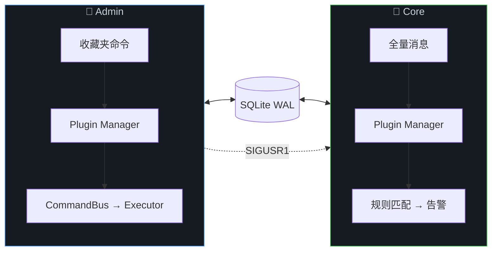
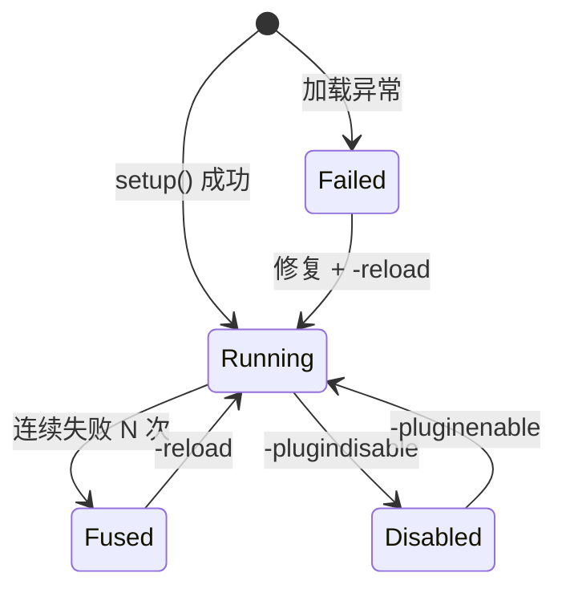

<div align="center">
# ⚡ TG-Radar
**Telegram 关键词监控系统**
全解耦插件架构 · 双进程分离 · 事件驱动同步

<br/>

[](https://github.com/chenmo8848/TG-Radar)
[](https://python.org)
[](https://github.com/LonamiWebs/Telethon)
[](LICENSE)
[](https://github.com/chenmo8848/TG-Radar/commits)

[**快速开始**](#-快速开始) · [**架构**](#-架构) · [**插件系统**](#-插件系统) · [**命令手册**](#%EF%B8%8F-命令手册) · [**📦 插件仓库 →**](https://github.com/chenmo8848/TG-Radar-Plugins)

</div>

---

## 🚀 快速开始

```bash
bash <(curl -sL https://raw.githubusercontent.com/chenmo8848/TG-Radar/main/install.sh)
```

> [!TIP]
> 全新 VPS（Ubuntu / Debian）以 root 执行即可。自动完成：`安装依赖` → `拉取仓库` → `创建环境` → `Telegram 授权` → `首次同步` → `启动服务`

<details>
<summary>📋 <b>手动部署</b></summary>

```bash
git clone https://github.com/chenmo8848/TG-Radar.git && cd TG-Radar
python3 -m venv venv && venv/bin/pip install -r requirements.txt
cp config.example.json config.json && nano config.json
PYTHONPATH=src venv/bin/python3 src/bootstrap_session.py
PYTHONPATH=src venv/bin/python3 src/sync_once.py
bash deploy.sh install-services
systemctl start tg-radar-admin tg-radar-core
```
</details>

---

## 🏗 架构



| | Admin 进程 | Core 进程 |
|:--|:--|:--|
| **职责** | 命令交互 · 后台任务 · 调度 | 全量消息监听 · 告警发送 |
| **Client** | 单 TelegramClient | 单 TelegramClient |
| **通信** | SQLite WAL 读写 | SQLite WAL 读写 + SIGUSR1 热重载 |

---

## ✨ 核心特性

|  | 特性 | 说明 |
|:--|:--|:--|
| 🧩 | **全解耦插件** | 所有业务功能为独立插件，独立配置 / 日志 / 生命周期 |
| ⚡ | **高性能** | 99% 消息零 API 调用跳过，命中后才懒加载，钩子并行执行 |
| 🔄 | **三层同步** | 实时（分组事件 ~3s）· 手动（`-sync`）· 定时（每日） |
| 🛡 | **稳定保障** | Session 自愈 · 错误熔断 · 异常隔离 · 独立日志 |
| 🔌 | **Plugin SDK** | `from tgr.plugin_sdk import PluginContext` 一行开发 |
| 🔥 | **热重载** | `-reload name` 秒级生效，`-update` 自动检测变更并重载 |

---

## 🧩 插件系统

> [!NOTE]
> 核心只提供基础设施，所有业务功能均为独立插件。完整文档 → [**TG-Radar-Plugins**](https://github.com/chenmo8848/TG-Radar-Plugins)

| 插件 | 类型 | 功能 | 配置 |
|:--|:--|:--|:--|
| `system_panel` | 内置 | help · plugins · reload · pluginconfig | — |
| `general` | Admin | ping · status · version · config · log · jobs | `panel_auto_delete_seconds` |
| `folders` | Admin | folders · rules · enable · disable | — |
| `rules` | Admin | addrule · setrule · delrule · setnotify · setalert · setprefix | — |
| `routes` | Admin | routes · addroute · delroute · sync · routescan | `auto_sync_enabled/time` |
| `system` | Admin | restart · update（自动重载变更插件） | `restart_delay_seconds` |
| `chatinfo` | Admin | 转发识别群 ID · 分组变动实时同步 | — |
| `keyword_monitor` | Core | 关键词匹配 · 告警发送 | `bot_filter` `max_preview_length` |

### 开发示例

```python
from tgr.plugin_sdk import PluginContext

PLUGIN_META = {"name": "hello", "version": "1.0.0", "kind": "admin"}

def setup(ctx: PluginContext):
    @ctx.command("hello", summary="打招呼", usage="hello", category="示例")
    async def handler(app, event, args):
        await ctx.reply(event, ctx.ui.panel("Hello", [ctx.ui.section("", ["👋"])]))
```

<details>
<summary>📚 <b>SDK 完整接口</b></summary>

| 分类 | 接口 | 说明 |
|:--|:--|:--|
| 配置 | `ctx.config.get / set / all` | 读写插件配置（`configs/name.json`） |
| 数据 | `ctx.db.list_folders / get_rules / log_event` | 白名单数据库方法 |
| 渲染 | `ctx.ui.panel / section / bullet / escape` | HTML 渲染 |
| 任务 | `ctx.bus.submit_job(kind, ...)` | 后台任务 |
| 日志 | `ctx.log.info / warning / error` | 插件独立日志 |
| 事件 | `ctx.emit(event, data)` / `@ctx.on(event)` | 事件总线 |
| 注册 | `@ctx.command` / `@ctx.hook` / `@ctx.cleanup` / `@ctx.healthcheck` | 装饰器注册 |
| 工具 | `ctx.client` / `ctx.reply(event, text)` | Telethon 客户端 / 统一回复 |
</details>

<details>
<summary>♻️ <b>插件生命周期</b></summary>


</details>

---

## ⌨️ 命令手册

> 在 Telegram **收藏夹**中发送，默认前缀 `-`

<details open>
<summary>📋 <b>通用</b></summary>

| 命令 | 说明 |
|:--|:--|
| `-help` | 命令列表 |
| `-ping` | 心跳检测 |
| `-status` | 系统状态 |
| `-version` | 版本信息 |
| `-config` | 核心配置 |
| `-log [scope] [n]` | 事件日志 |
| `-jobs` | 后台队列 |
</details>

<details>
<summary>📁 <b>分组</b></summary>

| 命令 | 说明 |
|:--|:--|
| `-folders` | 全部分组 |
| `-rules 名` | 分组规则 |
| `-enable / -disable 名` | 开启 / 关闭监控 |
</details>

<details>
<summary>📝 <b>规则</b></summary>

| 命令 | 说明 |
|:--|:--|
| `-addrule 分组 规则 词...` | 追加关键词（支持正则） |
| `-setrule 分组 规则 表达式` | 覆盖规则 |
| `-delrule 分组 规则 [词...]` | 删除 |
| `-setnotify / -setalert ID/off` | 通知 / 告警频道 |
| `-setprefix 前缀` | 修改前缀 |
</details>

<details>
<summary>🔄 <b>同步</b></summary>

| 命令 | 说明 |
|:--|:--|
| `-sync` | 手动同步 |
| `-routes / -addroute / -delroute` | 归纳规则管理 |
| `-routescan` | 手动扫描 |
</details>

<details>
<summary>🧩 <b>插件</b></summary>

| 命令 | 说明 |
|:--|:--|
| `-plugins` | 插件状态 |
| `-reload 名` | 热重载 |
| `-pluginreload` | 全量重载 |
| `-pluginenable / -plugindisable 名` | 启用 / 停用 |
| `-pluginconfig 名 [键] [值]` | 查看 / 修改配置 |
</details>

<details>
<summary>⚙️ <b>系统</b></summary>

| 命令 | 说明 |
|:--|:--|
| `-restart` | 重启双服务 |
| `-update` | 拉取更新 + 自动重载 |
| *(转发消息到收藏夹)* | 自动识别群 ID |
</details>

### 终端管理

```
TR              交互菜单          TR logs admin   Admin 日志
TR status       服务状态          TR logs core    Core 日志
TR restart      重启双服务        TR update       拉取更新
TR doctor       环境自检          TR reauth       重新授权
```

---

## 🔍 获取群 ID

**转发一条群消息到收藏夹**，系统自动回复来源群 ID 和快捷操作命令。

> [!IMPORTANT]
> 请转发**普通用户**发的消息。Bot 消息会识别出 Bot 本身而非所在群。

---

## 📂 项目结构

<details>
<summary>展开</summary>

```
TG-Radar/
├── config.json              核心配置（10 项）
├── configs/                 插件配置（自动生成）
├── runtime/
│   ├── radar.db             SQLite WAL
│   ├── sessions/            Telegram session
│   └── logs/                日志（含 plugins/ 子目录）
├── src/tgr/
│   ├── plugin_sdk.py        ★ 插件 SDK
│   ├── core/plugin_system.py  插件引擎
│   ├── admin_service.py     Admin 服务
│   ├── core_service.py      Core 服务
│   └── ...
├── plugins-external/        外部插件仓库
├── install.sh               一键部署
└── deploy.sh                终端管理器
```
</details>

<details>
<summary>⚙️ <b>核心配置说明</b></summary>

| 参数 | 说明 |
|:--|:--|
| `api_id` / `api_hash` | Telegram API 凭证（[获取](https://my.telegram.org)） |
| `cmd_prefix` | 命令前缀，默认 `-` |
| `operation_mode` | `stable` / `balanced` / `aggressive` |
| `global_alert_channel_id` | 默认告警频道 |
| `notify_channel_id` | 通知频道（null = 收藏夹） |
| `service_name_prefix` | systemd 服务名前缀 |
| `repo_url` / `plugins_repo_url` | 仓库地址 |
| `plugins_dir` | 插件目录路径 |
</details>

---

## ⚠️ 免责声明

本项目仅供**学习与技术研究**用途。使用者须确保行为符合所在地法律法规。开发者不对因使用本工具导致的任何损失承担责任。严禁用于未经授权的监控、骚扰、诈骗等非法活动。所有数据仅存储在用户自己的设备上。使用即表示同意上述条款。

---

<div align="center">

[**Core**](https://github.com/chenmo8848/TG-Radar) · [**Plugins**](https://github.com/chenmo8848/TG-Radar-Plugins)

<sub>Built with Telethon · SQLite WAL · APScheduler</sub>

</div>
